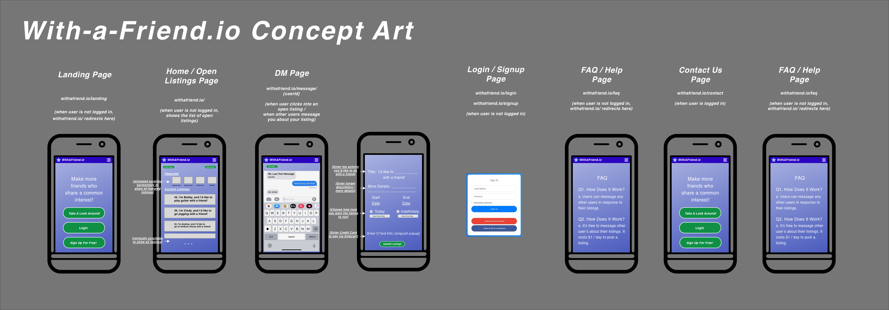
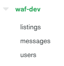
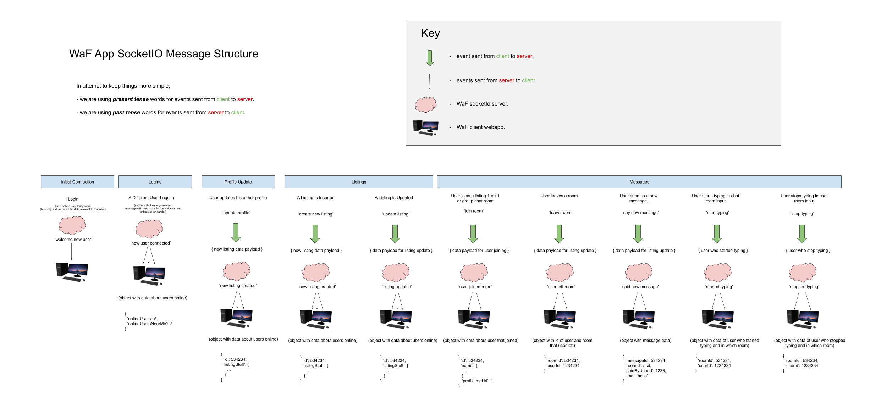

# WaF-Repo
Mono-repo for the With-A-Friend App!

## [Soon to be] Live Environments

### Dev

- frontend webapp: https://aws.123234.cloufront.io
- socket server endpoint: https://aws.90534.cloufront.io
- mongo cluster: mongodb+srv://<username>:<password>@cluster111111.mongodb.net/test?retryWrites=true&w=majority

### Staging

- frontend webapp: https://aws.123234.cloufront.io
- socket server endpoint: https://aws.90534.cloufront.io
- mongo cluster: mongodb+srv://<username>:<password>@cluster2222222.mongodb.net/test?retryWrites=true&w=majority

### Production 

- frontend webapp: https://webapp.io
- socket server endpoint: https://webappapi.net
- mongo cluster: mongodb+srv://<username>:<password>@cluster333333.mongodb.net/test?retryWrites=true&w=majority

# Vision
I think it is absolutely insane that I live in massive New York City yet I don't have a *good* way to make more friends here. 

_**WaF is a piece of software meant to connect people in real life.**_

There are some popular apps that already exist which try to do this, but to me none of them really cut it: 

- ____Facebook.com__ is just for family and people you already know._

- ___Meetup.com__ turns out to be big group things where I'm not really engaged._

- ___Dating apps__ are just about hooking up._


WaF is different because WaF is about individuals who happen to exist in a similar place and time finding each other and becoming friends over common interests. 


# Concept Art

Initial sketch drawings of the pages in the WaF app. 



# Data

For each enrivonment, have 1 mongo "database" with three collections to hold users, listings, and conversations.



// TODO - describe each of the objects better- User, Listing, Message


# Location

This app will be location-first (new buzzword?) meaning that the bulk of the application state will be dependent on location data. In this app, every user will have a location GeoJSON point (basically just two numbers: longitude and latitude), but specifically it's a regular JSON object with this  shape:

```
{
    type: "Point",
    coordinates: [0, 20]
}
```

[Thanks to my good friends on reddit](https://www.reddit.com/r/mongodb/comments/f6oobg/how_to_query_for_users_within_a_certain_distance/) I'm thinking we can save a lat / long location point to each user and to each listing. When the user opens the app it then only fetches for listings that are "near" (within X meters of) the user:

```
Consider a collection places that has a 2dsphere index.

The following example returns documents that are at least 1000 meters from and at most 5000 meters from the specified GeoJSON point, sorted from nearest to farthest:

db.places.find(
   {
     location:
       { $near :
          {
            $geometry: { type: "Point",  coordinates: [ -73.9667, 40.78 ] },
            $minDistance: 1000,
            $maxDistance: 5000
          }
       }
   }
)
```
^ see more about this [here](https://docs.mongodb.com/manual/reference/operator/query/near/#op._S_near).


# Auth

For authentication we're using the good old auth0! Client-side code for the googel / facebook integrationg was inspired by [this nice repo](https://github.com/auth0-blog/gatsby-auth0).

Auth0 on Jim's Gh, "Single-page App"

- waf-dev
- waf-staging
- waf-production

# Initial Sockets Architecture

To keep things realtime, most of the data transfer will happen via [socketIo](https://socket.io/docs/) events. Here's a diagram for the inial plan for the events for WaF app. 
_Note: the most up-to-date version of this is [here](https://docs.google.com/drawings/d/1oxLMYoFBzs7PLJfJP0kSswtDAGsNcgwF3tt53YYzvW4/edit?usp=sharing)- ask jim for permissions! :)_ 





# Code

## Front-End Code

The front-end code is a React webapp build with Gatsby (specifically, the awesome [TDD BDD template from Evaluates2](https://github.com/Evaluates2/Gatsby-Starter-TypeScript-Redux-TDD-BDD)).

_Learn more about the frontend in the README in [waf-frontend-gatsby](https://github.com/JimLynchCodes/WaF-Repo/tree/master/waf-frontend-gatsby)!_

## Back-End Code

The backend is a relatively simple [socket.io](https://socket.io/docs/) server that is just run with `node index.js`. 

_Learn more about the backend in the README in [waf-socket-server](https://github.com/JimLynchCodes/WaF-Repo/tree/master/waf-socket-server)!_


# Release Plan

// TODO 😅

Basically, we need to set up three environments for dev, staging, and production. Then we can connect them to the CI / CD pipelines for the git branches dev, staging, and master (respectively).

### Releases
1. When features pass all the tests locally and looks good then the code is merged into dev and the ci pipeline deploys to the dev environment. 

2. If all good in the dev environment deployment, we merge the dev branch into staging and let the ci pipeline deploy to the staging environment.

3. If all good in staging, we merge the staging code to the master branch and let the ci pipeline deploy to the production environment.

_When deploying features from staging to production it's nice to leave git release tags as you go!_  
